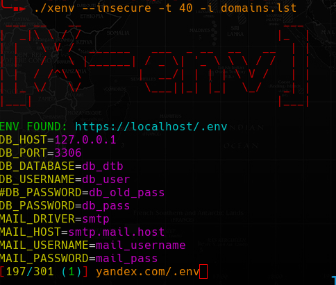

# X-ENV



Scan for exposed env file.

## Usage:

```
-h, --help                   Show this help
-t, --thread=NBR             Number of threads (default 50)
-o, --output=FILE            Output file (default found_env.txt)
-i, --input=FILE             Input file
-e, --env-path=ENV           Env Path (comma separated)
-k, --insecure               Ignore certificate errors
-u, --user-agent=USR         Set user agent
-p, --proxy=PROXY            Use proxy (proto://ip:port)
-V, --version                Print version and exit
```

**[!] note:**  `-e|--env-path` souldn't have space and must start with `/`.

By default it only scan for "/.env", but most common path are:

- /.env
- /api/.env
- /core/.env
- /admin/.env
- /local/.env
- /docker/.env
- etc...


## Examples:

```sh
$ xenv -i top-alexa.txt
$ xenv -i top-alexa.txt -k -e "/.env,/api/.env,/core/.env"
$ xenv -p socks5://127.0.0.1:9050 -o good.txt -i top-alexa.txt -t 60
```

**Example of input file:**

```
google.com
github.com
domain.com/code
```

**note:** domain in list shouldn't have protocol in them:

 
```go
req, err := http.NewRequest("GET", "https://"+url+"/.env/", nil)
```


#### WARNING

Do not use too much threads or you will DOS yourself.


## Install:

With one liner if **$GOROOT/bin/** is in **$PATH**:

```sh
go install github.com/mmpx12/xenv@latest
```

or from source with:

```sh
git clone https://github.com/mmpx12/xenv.git
cd xenv
make
sudo make install
# or 
sudo make all
```

for **termux** you can do:

```sh
git clone https://github.com/mmpx12/xenv.git
cd xenv
make
make termux-install
# or
make termux-all
```


There is also prebuild binaries [here](https://github.com/mmpx12/xenv/releases/latest).
